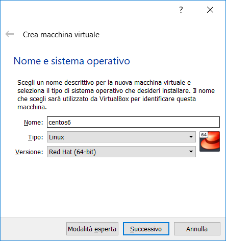
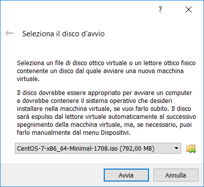
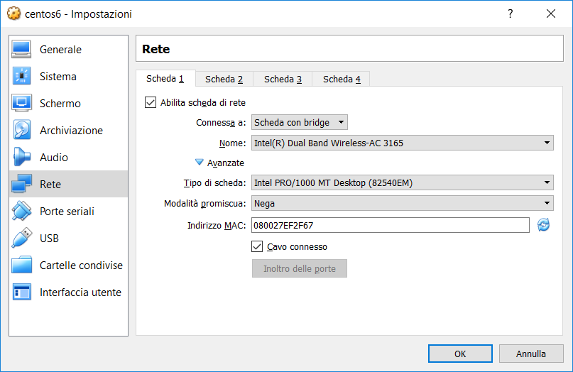

.. meta::
   :language: it
   :description language=it: Appunti di Complex Systems Design - Edinburgh Concurrency Workbench
   :description language=en: Notes on Complex Systems Design - Edinburgh Concurrency Workbench
   :keywords: Complex Systems Design, Edinburgh Concurrency Workbench, CWB
   :author: Luciano De Falco Alfano

.. index:: edinburgh concurrency workbench

.. _ref_edinburgh_concurrency_workbench:
   
Edinburgh Concurrency Workbench
================================

.. contents:: 
   :local:

L\ ``'``\ `Edinburgh Concurrency Workbench <http://homepages.inf.ed.ac.uk/perdita/cwb/>`_
è un programma con interfaccia a linea di comando utilizzabile per 
modellare e verificare specifiche di sistemi concorrenti, sviluppato
da Stevens Perdita c/o l'Università di Edimburgo.

E\ ``'`` disponibile precompilato per vari sistemi Unix e Unix like, tra cui  Linux
su processori Intel x86. Nel suo sito viene dichiarato (forse) compatibile con Red Hat ver.5.
Purtroppo questa versione non è più supportata dal 2017. Di conseguenza nel 
seguito effettueremo una installazione su CentOS 6, il cui supporto terminerà nel 
nov.2020.

E\ ``'`` importante sapere che questo programma è stato successivamente ripreso
dalla Università di Stato del North Carolina, e dopo varie vicissitudini, ne
è ora disponibile anche una versione per MS Windows. Per chi volesse provarla, 
ne parliamo in :ref:`Concurrency Workbench of the New Century <ref_concurrency_workbench_of_the_new_century>`.

Riprendendo con la procedura d'installazione del CWB originale, 
supporremo di utilizzare una macchina MS Windows. Per questo motivo il processo d'installazione
prevede tre aree d'intervento:

1. installazione ed uso del virtualizzatore `Oracle VirtualBox <https://www.virtualbox.org/wiki/Downloads>`_;
2. installazione nella macchina virtuale di una distribuzione minimale
   (sola interfaccia utente a linea di comando) `CentOS 6 <https://www.centos.org/>`_ [#]_;
3. installazione di CWB nella macchina *CentOS 6*.

Se si vuole preparare direttamente un computer *CentOS 6*
si può evitare il punto (1.).

Se si dispone già di un computer *CentOS 6* 
configurato per accedere ad Internet, si possono evitare i punti (1.) e (2.).

.. index:: installazione di virtualbox

.. _ref_installazione_di_virtualbox:
   
Installazione di VirtualBox
-----------------------------

L'installatore di *VirtualBox* per MS Windows può essere scaricato da
`questo link <https://download.virtualbox.org/virtualbox/6.0.4/VirtualBox-6.0.4-128413-Win.exe>`_.

L'installatore deve essere eseguito con privilegi di amministratore. Come la maggior
parte degli installatori per MS Windows, l'uso è molto semplice. In caso di 
problemi fare riferimento a `questa documentazione <https://www.virtualbox.org/manual/UserManual.html#intro-installing>`_.

A questo punto avviare *Oracle VM VirtualBox*, creare una nuova macchina virtuale
(voci di menù: **Macchina** / **Nuova**) e indicare i relativi parametri:

   
accettare i default per i parametri successivi. Verrà creata una macchina virtuale vuota.

Se si vorranno installare le guest additions, per condividere directory tra host e guest:

* scaricarle `dal sito di Oracle <https://download.virtualbox.org/virtualbox/5.2.26/Oracle_VM_VirtualBox_Extension_Pack-5.2.26.vbox-extpack>`_;
* e installarle in *Oracle VM VirtualBox* (voci di menù: **File** / **Preferenze** / **Estensioni**,
  premere il pulsante + e selezionare il file 
  scaricato: ``Oracle_VM_VirtualBox_Extension_Pack-5.2.26.vbox-extpack``).

.. index:: installazione di centos 6

.. _ref_installazione_di_centos_6:
   
Installazione di CentOS 6
-----------------------------

Scaricare una `ISO minimale di CentOS 6 <http://mirrors.prometeus.net/centos/6.10/isos/x86_64/CentOS-6.10-x86_64-minimal.iso>`_.

Creata la macchina virtuale vuota, avviarla (selezionarla, quindi eseguire le voci di 
menù: **Macchina** / **Avvia** / **Avvio Normale**).

All'avvio verrà richiesta la ISO di bootstrap, similmente a quanto mostrato 
qui sotto [#]_:

   
Selezionare il file ISO scaricato in precedenza ed eseguire il successivo processo d'installazione
del sistema operativo.

Completata l'installazione del sistema operativo, controllare la configurazione di rete della
macchina virtuale. Dobbiamo fare in modo che la VM guest sia in grado di raggiungere 
Internet. A questo scopo selezioniamo le opzioni di rete della VM (menù
**Macchina** / **Impostazioni** - **Rete**) e configuriamole come segue:

   
E\ ``'`` importante simulare ad host una **scheda con bridge**, che si appoggi all'hardware
della macchina (nella figura precedente: **Intel Dual Band Wireless-AC 3165**, che
è il processore della rete wireless del PC Host). Dopo di che verificare che
sia marcato il check di **cavo connesso**. Il tipo di scheda simulata indicata nella 
figura (**Intel PRO/1000 MT Desktop ...**) è quella *standard*, quasi ogni sistema operativo
guest è in grado di gestirla.

Riavviata la macchina virtuale, dobbiamo configurare la rete del guest.

Prima di tutto controllare la mappatura della tastiera. Se è ok, bene. Altrimenti:

.. code:: console

   vi /etc/sysconfig/keyboard
     # modify the following keys: KEYTABLE and LAYOUT, referencing your keyboard type
     # for example: KEYTABLE="it"
   init 6       # reboot VM
   
Dopo di che configurare la rete, ad esempio via dhcp, come segue:

.. code:: console

   vi /etc/sysconfig/network-scripts/ifcfg-eth0
     # set these values (do not change the others)
     #   ONBOOT=yes
     #   NM_CONTROLLED=no
     #   BOOTPROTO=dhcp
   service restart network
   ifconfig eth0      # check inet addr

Ora un minimo di configurazione generale:

.. code:: console

   # login using ssh client to previous inet addr
   yum update                                         # on feb.2019 this loads kernel 0:2.6.32 el6.x86-64
   yum install vim                                    # for my comfort
   yum install wget                                   # to download from web
   
Se si progetta di utilizzare una directory condivisa tra sistema host e 
guest, eseguire i seguenti comandi:

.. code:: console
   
   # use the following cmds only if you wish to use the guest extensions (to share directories)
   yum --enablerepo=extras install epel-release       # we'll need the extra repository ...
   yum install dkms                                   #   ... to load more easily a compiled new kernel
   yum groupinstall "Development Tools"               #       and dev.tools (c compiler, include files ...)
   mkdir /mnt/cdrom                                   # create a dir to mount cdrom
   mkdir /mnt/shared                                  # create a dir to mount shared directory
   mount -t iso9660 /dev/scd0 /mnt/cdrom              # mount cdrom (it must contain the VBoxLinuxAdditions iso file)
   sh /mnt/cdrom/VBoxLinuxAdditions.run               # execute the VBoxLinuxAdditions installation on guest
   init 6                                             # system reboot
   
sempre in caso di directory condivisa, creare il file ``/etc/profile.d/shared.sh`` per effettuare la mount 
della directory condivisa all'avvio del sistema:

.. code:: console

   vim /etc/profile.d/share.sh                        # must signal "new file"; this is to mount the shared directory at system startup;
   # add the next line in the file (whitout #)
   # mount -t vboxsf VirtualBox_Shared /mnt/shared      # if you have in host the directory VirtualBox_Shared configured using VirtualBox Manager
                                                        #   ... Macchina / Impostazioni / cartelle condivise / pulsante + / ...
   init 6
   touch /mnt/shared/pippo.txt                          # create pippo.txt in /mnt/shared; you'll see it in guest using "ls /mnt/shared"
                                                        # ... and in host using "esplora file" browsing to VirtualBox_Shared

   
.. index:: installazione di cwb nella vm

.. _ref_installazione_di_cwb_nella_vm:
   
Installazione di CWB nella VM
--------------------------------

Ora che abbiamo il collegamento ad Internet possiamo scaricare CWB effettuando le seguenti
attività:

.. code:: console

   wget http://homepages.inf.ed.ac.uk/perdita/cwb/CWBEXPORTDIR/xccscwb.x86-linux.gz   # getting the intel+linux CWB image
   yum install glibc-2.12-1.212.el6.i686              # we need this one because we work in centos 6 (ver.5 is no more supported), and CWB uses it
   gunzip xccscwb.x86-linux.gz                        # decompressing the archive (NOTE: this command deletes the compressed archive)
   chmod +x xccscwb.x86-linux                         # makes runnable the extracted file
   ./xccscwb.x86-linux                                # here we go! enjoi ...   
   
Qui di seguito un esempio di avvio di WCB e la richiesta di help dei comandi:   
   
.. code:: console

   login as: root
   root@192.168.1.11's password:
   Last login: Sat Feb  9 23:28:41 2019
   [root@localhost ~]# ./xccscwb.x86-linux
   
   Edinburgh Concurrency Workbench, version 7.1,
   Sun Jul 18 21:19:30 1999
   Process algebra: CCS
   Optional modules in this build: AgentExtra,Graph,Divergence,Contraction,
   Equivalences,Logic,Simulation,Testing
   Command: help commands;
   
   agent: change (or show) the definition of an agent identifier
   branchingeq: are agents branching bisimilar?
   ccs: show CCS syntax
   checkprop: model-checking: does an agent satisfy a formula?
   checkpropold: DEPRECATED modelchecking using old algorithm
   clear: removes all bindings (a fresh start)
   closure: find the weak derivatives of an agent via a trace
   cong: are two agents observationally congruent (equal)?
   contraction: are agents related by the contraction pre-order?
   cwb: mostly for internal use: set CWB options
   deadlocks: find dead- or live-locked states and traces leading to them
   deadlocksobs: find dead- or live-locked states with observations
   derivatives: find the derivatives of an agent via a given action
   dfstrong: find a strong HML formula distinguishing two agents
   dftrace: find a trace distinguishing two agents
   dfweak: find a weak HML formula distinguishing two agents
   diveq: are two agents divergence equivalent?
   diverges: does the agent contain an unguarded occurrence of @?
   echo: print a string to whereever output's going
   eq: are two agents observationally equivalent (weakly bisimilar)?
   findinit: find states with a given set of next observable actions
   findinitobs: find states with a given set of next observable actions
   freevars: list the free agent variables of an agent
   game: play model-checking games
   globalmc: DEPRECATED option for old modelchecking algorithm
   graph: list the transition graph of an agent
   help: provide on-line help
   init: find the observable actions an agent can perform immediately
   input: execute the CWB commands in the given file
   localmc: DEPRECATED option for old modelchecking algorithm
   logic: show logic syntax
   mayeq: are two agents may equivalent, i.e. trace equivalent?
   maypre: are two agents related by the may preorder?
   min: minimise an agent with respect to weak bisimulation
   musteq: are two agents must equivalent?
   mustpre: are two agents related by the must preorder?
   normalform: print an agent in normal form
   obs: find observations of a given length, and their results
   output: control where CWB output is written
   pb: print largest weak bisimulation over the state-space of two agents
   pre: are two agents related by the (weak) bisimulation preorder?
   precong: are two agents related by the bisimulation precongruence?
   prefixform: print an agent in prefix form
   print: show the definitions of all identifiers
   prop: change (or show) the definition of a proposition identifier
   quit: terminates the workbench session
   random: give a pseudo-random observation of at most a given length
   relabel: change (or show) the definition of a relabelling identifier
   save: save the current environment in a file
   set: change (or show) the definition of a set identifier
   sim: simulate an agent interactively
   size: find the number of states of a finite-state agent
   sort: find the syntactic sort of the agent
   stable: is the agent stable?
   states: list the state-space of a finite-state agent
   statesexp: list the state-space, and a trace leading to each state
   statesobs: list the state-space and an observation leading to each state
   strongeq: are two agents strongly bisimilar?
   strongpre: are two agents related by the strong bisimulation preorder?
   testeq: are two agents testing equivalent (i.e. failures equivalent)?
   testpre: are two agents related by the testing preorder?
   toggle: toggle various CWB user options
   transitions: list the (single-step) transitions of an agent
   twothirdseq: are agents related both ways by 2/3 bisimulation preorder?
   twothirdspre: are two agents related by the 2/3 bisimulation preorder?
   vs: find observations of a given length
   
   Command: quit;

   Quitting: user said so
   [root@localhost ~]#
   
La manualistica è disponibile presso questo link: http://homepages.inf.ed.ac.uk/perdita/cwb/doc/,
in particolare si faccia riferimento a http://homepages.inf.ed.ac.uk/perdita/cwb/doc/manual.pdf.
   
   
.. index:: CWB list of more used commands

.. _ref_cwb_list_more_used_commands:
   
CWB list of more used commands
--------------------------------

Controllo::

   checkprop: model-checking: does an agent satisfy a formula?
   clear: removes all bindings (a fresh start)
   cong: are two agents observationally congruent (equal)?
   deadlocks: find dead- or live-locked states and traces leading to them
   dfstrong: find a strong HML formula distinguishing two agents
   help: provide on-line help
   init: find the observable actions an agent can perform immediately
   input: execute the CWB commands in the given file
   output: control where CWB output is written
   print: show the definitions of all identifiers
   quit: terminates the workbench session
   sim: simulate an agent interactively

Da provare::
   
   dftrace: find a trace distinguishing two agents
   dfweak: find a weak HML formula distinguishing two agents
   
Definizione dei processi::

   agent: change (or show) the definition of an agent identifier
   set: change (or show) the definition of a set identifier
   relabel: change (or show) the definition of a relabelling identifier
   prop: change (or show) the definition of a proposition identifier
   
   
   
---------------------

.. [#] Il link indicato è relativo al progetto CentOS, che è un progetto
   Open Source derivato da Red Hat. A differenza di quest'ultimo 
   non viene richiesto canone di manutenzione per l'utilizzo del sistema.
   Allo stato attuale il progetto pubblica e manutiene le verioni 6 e 7.
   
.. [#] In figura appare selezionata la ISO di *CentOS 7*. **Invece**
   queste note sono relative a *CentOS 6* (alcuni comandi, ad es. quelli
   per la gestione dei servizi, sono cambiati tra le due diverse versioni).
   Se si intendono eseguire i comandi qui indicati, si scarichi (come indicato)
   la ISO di *CentOS 6*, e in questa finestra di dialogo la si selezioni.